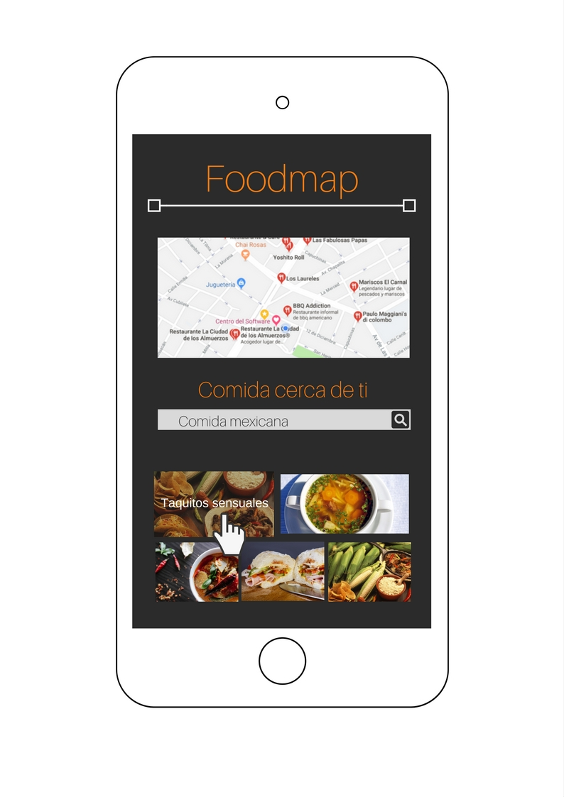

# Reto - Food Map

* **Track:** _Common Core._
* **Curso:** _Crea tu propia red social._
* **Unidad:** _Agiliza tu desarrollo._
* **Alunma:** _Yosseline Apcho._

***

## Objetivos:

- Crear una web-app que a través de un input pueda filtrar los restaurantes que se encuentran cerca del usuario.

***

## Flujo de la aplicación:

* Vista splash con duración de 2 a 5 segundos que redirecciona a la vista de inicio:

* En la vista principal se muestran todos los restaurantes ceerca del usuario, junto con el input para filtrar su elección:

* Ya que el usuario hizo la elección del filtro deben mostrarse únicamente aquellos restaurantes que cumplan con la condición:

* Al hacer click en cualquier imagen de un restaurante, se observa un evento 'mouseover':

* Al seleccionar alguno de los restaurantes, se muestra la información de éste a través de un modal:

* Una vez cerrado el modal, se vuelve a la vista principal:

 

***

## Consideraciones:

- El estilo de las vistas, incluyendo sus elementos, han sido modificados para una mejor experiencia.

- La web-app cuenta con una versión Desktop, apropiada para el tamaño de dicha versión.

- Los bordes de los botones fueron modificados para una mejor experiencia.

- Los modales han sido modificados, conservando las tonalidades de la página.

- El color de la barra de navegador que se observará al abrir la web-app 'Food Map' desde un móvil, fue cambiado al color representativo de la página web, para una mejor experiencia.

- El estilo del cursor fue modificado para una mejor interacción con la web-app.

***

## Herramientas usadas:

- HTML5.

- CSS3.

- Bootstrap.

- jQuery.
